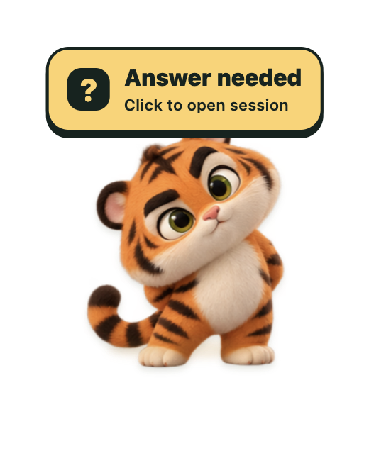
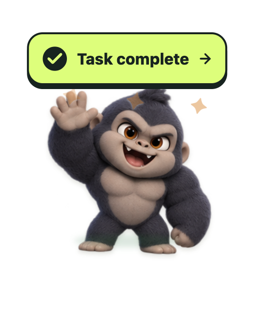

# Session-Pets

[한국어](README.ko.md) · [Usage guide](docs/usage.md)


**One desktop pet for each Codex or Claude Code session.**

Give each session its own gorilla, tiger, or custom character, and keep pets from multiple sessions on your desktop at the same time. Each pet stays linked to its own session: click it to return, or look for an alert when your input is needed. A green badge marks a confirmed Codex turn completion.

**[Download for macOS · Apple Silicon](https://github.com/yback1223/session-pets/releases/latest)**

Requires macOS 13 or later on Apple Silicon. Free and independent, made by [yback](https://github.com/yback1223).

| On your desktop | When your answer is needed | When a Codex turn finishes |
|:---:|:---:|:---:|
|  |  |  |

## Install

1. Download and unzip **`Session-Pets-v0.2.2-macos-arm64.zip`** from [Releases](https://github.com/yback1223/session-pets/releases/latest).
2. Double-click **`Install Session Pets.command`**. It installs the app in `~/Applications` and the local skills for Codex and Claude Code. **Python 3 is required**; Node.js is not required for the ZIP.
3. Open **`Session Pets.app`**, then summon a pet from the session you want to connect:

| Host | Summon | Choose another pet | Hide this pet |
|---|---|---|---|
| Codex | `$Session-Pets` | `$Session-Pets choose` | `$Session-Pets hide` |
| Claude Code | `/Session-Pets` | `/Session-Pets choose` | `/Session-Pets hide` |

On the first call, use the arrows to browse, then click the character or press **Enter**. Your choice is remembered for that session. Repeat this in each session you want to keep on screen; their pets can appear together. Reload your host's skills or restart the host if the command does not appear.

**macOS first launch:** the app is not Developer ID signed or notarized. If macOS blocks an item you trust, try opening it once, then go to **System Settings → Privacy & Security → Open Anyway** and confirm. Follow [Apple's instructions](https://support.apple.com/en-us/102445); the installer does not disable macOS security checks.

### Claude Code: enable status updates

The local skill summons pets. Claude question, approval, and subagent events also need the plugin enabled in the Claude Code session:

```text
/plugin marketplace add yback1223/session-pets
/plugin install session-pets@session-pets
```

The plugin also provides `/session-pets:Session-Pets`. See the [Claude setup and limits](docs/usage.md#claude-code-plugin) for local installation and session-opening details.

### Distribution status

The app and plugin packages are available in [GitHub Releases](https://github.com/yback1223/session-pets/releases/latest). The commands above install from yback's public Claude marketplace. Official OpenAI and Anthropic directory publication is **not yet confirmed**. The release includes a separate OpenAI-format plugin ZIP for submission; see the [distribution guide](docs/DISTRIBUTION.md).

## Using your pet

- **Gorilla Boss and Roary**, a gorilla and a tiger with 16 poses each. Import a transparent PNG or an animated sprite sheet to use your own pet.
- **Click to return, drag to move.** Double-click to dance; scroll to change its expression.
- **Tools appear on hover or keyboard focus.** Name, details, change, and hide controls stay tucked away otherwise. There is no persistent “working” badge.
- **Attention stays visible.** Question and approval badges remain visible without hovering. A confirmed Codex completion gets a green badge until acknowledged or a new turn begins.
- **The pet follows its host's display language.** English and Korean are built in. Other languages are translated by your existing Codex or Claude session on first use and cached locally; the command stays `Session-Pets` in every language.

## What each host supports

| Feature | Codex | Claude Code |
|---|---|---|
| Per-session pet, custom artwork, click back to session | Supported | Supported; CLI-to-Desktop handoff has host restrictions |
| Answer-needed badge | Structured questions, including asynchronous questions; verified | Plugin hooks connected; tested with local fixtures |
| Approval-needed badge | No separate automatic approval detection | Plugin hooks for plan and permission requests |
| Confirmed completion badge | Explicit end-of-turn records; verified | Not confirmed from `Stop` or `SubagentStop` |
| Automatic small subagent pets | Not supported | Explicit subagent-start hooks; parent pet must be connected |

“Task complete” means **the observed Codex turn ended**, not that every project requirement was satisfied. Claude's full live question flow and final completion are not verified; a reply can remain “completion unconfirmed.” Automatic links between Codex sessions are not supported. See [status behavior](docs/usage.md#status-and-support-boundaries).

## Local data and permissions

The desktop app uses local files and Unix sockets, with no telemetry or analytics client and no separate API key. It reads linked Codex execution records and selected host settings. Claude hooks can send the latest assistant reply to the app's memory. Preferences, imported pets, and translations are stored locally. [Read the exact data scope](docs/usage.md#local-data-and-permissions).

Your host's account, model usage, and execution permissions still apply. Session-Pets does not grant approvals or change host approval policies.

## Run from source

Requires macOS, **Node.js 22.12+**, npm, and **Python 3**. From the project directory:

```sh
npm ci
npm start
```

To build the app and install its session skills:

```sh
npm run pack
npm run install:integrations
```

[Custom pet format, troubleshooting, and development checks →](docs/usage.md)

## License

[MIT](LICENSE) · Copyright 2026 yback. Built-in character artwork was generated for this project. Session-Pets is an independent project, not affiliated with or endorsed by OpenAI or Anthropic.

[Support](docs/SUPPORT.md) · [Privacy](docs/PRIVACY.md) · [Terms](docs/TERMS.md)
